# Daniel

<table>
  <tr>
    <td valign="top">
      
<strong>Backend Developer | Automation | Community Systems</strong>

      

        I build practical tools, internal automation, and reliable web applications with a focus on maintainable backend systems.
      

      

        My main stack includes Python, PHP, Laravel, and MySQL, and I enjoy creating software that supports real operational and community needs.
      

    </td>
    <td width="170" align="center">
      
    </td>
  </tr>
</table>

## Current Roles

- S1 Controller at [VATSIM UK](https://www.vatsim.uk/)
- Contributor at [VATSIM UK](https://www.vatsim.uk/)

## Focus Areas

- Backend development with PHP, Laravel, and MySQL
- Automation and internal tooling with Python and GitHub Actions
- Community systems and bot development with Discord.py

## Featured Projects

  
  

  

## Tech Stack

  
  
  
  
  
  
  

## GitHub Overview

  
  

